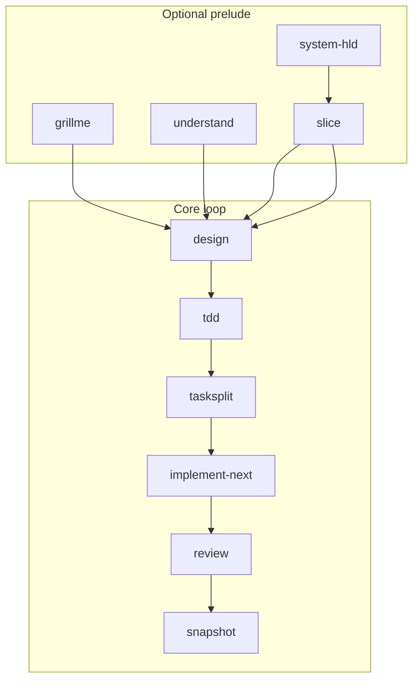

# devflow

A **public, reusable AI engineering workflow framework** for coding agents (Cursor, Claude Code, Codex, Windsurf, Copilot, and compatible tools). It replaces mega-prompts with **bounded skills**, **contract-based handoffs**, and **human approval gates**.

> This repository ships the **framework only** — not a sample application. Attach it to any project and drive work through slash-command skills.

**Documentation index:** [docs/README.md](docs/README.md)  
**Dev Loop:** [docs/DEV_LOOP.md](docs/DEV_LOOP.md)  
**Install & setup:** [docs/GETTING_STARTED.md](docs/GETTING_STARTED.md)

## Your product spec (`AI_CONTEXT/SPEC.md`)

All workflows treat **`AI_CONTEXT/SPEC.md`** as the durable source of truth — not one-off chat text.

| You do | Agent does |
|--------|------------|
| Edit or paste your requirements into `AI_CONTEXT/SPEC.md` before a session | Reads that file on every skill |
| Attach the file in chat (e.g. `@AI_CONTEXT/SPEC.md` in Cursor) when invoking a skill | Uses your file as input; does not rely on a vague slash command alone |
| Add a **Current change** section with the feature you want (or let `/understand` help write it) | Updates the same file in place (grill-style Q&A) |

**Existing repo:** put the change in `SPEC.md`, then `/understand` — orientation plus spec refinement and blast-radius notes land back in **`SPEC.md`**.

**New product:** start from `core/templates/SPEC.template.md`; `/grillme` interviews you and keeps refining **`SPEC.md`**.

## Why use it

| Problem | How this framework helps |
|---------|---------------------------|
| AI rewrites legacy code blindly | `/understand` captures layout + conventions from the real repo |
| Giant uncontrolled codegen | `/implement-next` runs **one** task per invocation |
| Context window overload | Skills consume compact `*.contract.yaml`, not full chat history |
| No audit trail for AI plans | `/design` writes `*_DESIGN.md`; `/tasksplit` writes the task queue |
| Architecture drift | `/system-hld` + `/slice` lock system shape before feature work |

---

## Dev Loop

One workflow for all projects. **Optional prelude** skills depend on repo state — pick what you need.

```text
Optional prelude:
  /grillme | /understand | /system-hld | /slice

Core loop (per feature):
  /design <FEATURE> → /tdd → /tasksplit → /implement-next → /review → /snapshot
```



### Which prelude to run

| Situation | Start with |
|-----------|------------|
| Spec vague or empty | `/grillme` |
| Existing codebase | `/understand` + `@AI_CONTEXT/SPEC.md` |
| New product / system shape | `/grillme` → `/system-hld` → `/slice` |
| Large multi-part change | `/slice` after orientation or HLD |

### Core commands

| Command | What it does |
|---------|----------------|
| `/design <FEATURE>` | Per-feature design (incremental or bundled) |
| `/tdd <FEATURE>` | Test cases after design approved |
| `/tasksplit <FEATURE>` | Task queue `FEATURE:Cn` |
| `/implement-next` | Next pending task |
| `/review` / `/snapshot` | Human-owned verification |

### Approval gates

1. **Design** — Approve stages in chat; `design_status: approved` before `/tdd`.
2. **Tasks** — `tasks_status: approved` on `<FEATURE>_TASKS.contract.yaml` before `/implement-next`.
3. **Task** — Review signoff before `/snapshot`.

### Example (existing repo)

```text
/understand @AI_CONTEXT/SPEC.md
/design OTP_LOGIN
# approved (per stage)
/tdd OTP_LOGIN
/tasksplit OTP_LOGIN
# tasks approved
/implement-next → /review → /snapshot
```

Detail: [docs/DEV_LOOP.md](docs/DEV_LOOP.md). Existing-repo principles: [docs/DELTA_PRINCIPLES.md](docs/DELTA_PRINCIPLES.md).

---

## Quick start (Cursor)

```powershell
path\to\devflow\installer\install.ps1 -TargetPath .
```

1. Edit **`AI_CONTEXT/SPEC.md`**; attach **`@AI_CONTEXT/SPEC.md`** and run prelude skills as needed (`/understand`, `/grillme`, …).
2. **`/design <FEATURE>`** → approve → **`/tdd`** → **`/tasksplit`** → approve tasks.
3. Loop **`/implement-next`** → **`/review`** → **`/snapshot`** until the queue is empty.

Skills live under `.cursor/skills/` after install (synced from `core/skills/`).

---

## Slash commands (full list)

See [core/skills/README.md](core/skills/README.md). Canonical sources: [`core/skills/`](core/skills/). After editing, run **`installer/sync-cursor.ps1`**.

---

## Repository map

```text
devflow/
├── AI_CONTEXT/
│   └── SPEC.md           # Your product spec — edit or @-attach in chat
├── core/
│   ├── AGENTS.md         # Canonical agent harness (edit here)
│   ├── skills/           # Canonical SKILL.md modules
│   ├── templates/
│   ├── contracts/
│   └── hooks/
├── adapters/
├── installer/
├── docs/                 # DEV_LOOP, GETTING_STARTED, …
└── examples/
```

**Rule:** Edit **`core/`** only. Run **`installer/sync-cursor.ps1`** to refresh `.cursor/`. See [CONTRIBUTING.md](CONTRIBUTING.md).

## Multi-agent support

| Agent | Adapter notes |
|-------|----------------|
| Cursor | [adapters/cursor/README.md](adapters/cursor/README.md) |
| Claude Code | [adapters/claude/README.md](adapters/claude/README.md) |
| Codex | [adapters/codex/README.md](adapters/codex/README.md) |
| Windsurf | [adapters/windsurf/README.md](adapters/windsurf/README.md) |
| Copilot | [adapters/copilot/README.md](adapters/copilot/README.md) |

## Design principles

1. **No mega prompts** — small composable skills  
2. **Files over chat** — plans and contracts in `AI_CONTEXT/`  
3. **Human code ownership** — explicit approval before implement; review before snapshot  
4. **Delta thinking** — smallest safe change, match existing conventions ([DELTA_PRINCIPLES.md](docs/DELTA_PRINCIPLES.md))  
5. **Contract-based handoff** — human doc + `.yaml` contract per stage  
6. **Vertical tasks** — one `FEATURE:Cn` at a time  

## Status

**v1** — Dev Loop, installer, and Cursor sync are in place. See [AI_CONTEXT/SPEC.md](AI_CONTEXT/SPEC.md).

## Contributing

See [CONTRIBUTING.md](CONTRIBUTING.md).

## License

[MIT](LICENSE)
