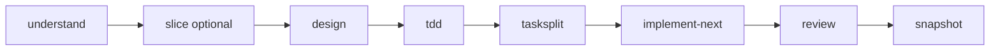
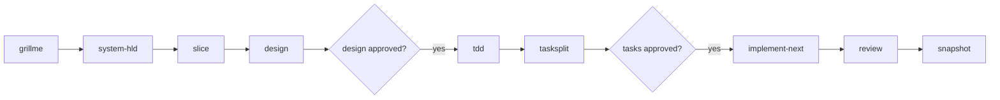

# devflow

A **public, reusable AI engineering workflow framework** for coding agents (Cursor, Claude Code, Codex, Windsurf, Copilot, and compatible tools). It replaces mega-prompts with **bounded skills**, **contract-based handoffs**, and **human approval gates** so teams can evolve **existing codebases** safely.

> This repository ships the **framework only** — not a sample application. Attach it to any project and drive work through slash-command skills.

**Documentation index:** [docs/README.md](docs/README.md)  
**Brownfield (existing repo):** [docs/BROWNFIELD_DEV_LOOP.md](docs/BROWNFIELD_DEV_LOOP.md)  
**Greenfield (new product):** [docs/GREENFIELD_DEV_LOOP.md](docs/GREENFIELD_DEV_LOOP.md)  
**Install & setup:** [docs/GETTING_STARTED.md](docs/GETTING_STARTED.md)

## Your product spec (`AI_CONTEXT/SPEC.md`)

All workflows treat **`AI_CONTEXT/SPEC.md`** as the durable source of truth — not one-off chat text.

| You do | Agent does |
|--------|------------|
| Edit or paste your requirements into `AI_CONTEXT/SPEC.md` before a session | Reads that file on every skill |
| Attach the file in chat (e.g. `@AI_CONTEXT/SPEC.md` in Cursor) when invoking a skill | Uses your file as input; does not rely on a vague slash command alone |
| Add a **Current change** section with the feature you want (or let `/understand` help write it) | Updates the same file in place (grill-style Q&A for brownfield) |

**Brownfield:** put the change you want in `SPEC.md` (or attach it), then run `/understand` — orientation plus spec refinement and blast-radius notes land back in **`SPEC.md`**.

**Greenfield:** start from the template in `core/templates/SPEC.template.md`; `/grillme` interviews you and keeps refining **`SPEC.md`**.

The quoted phrases in examples below (e.g. `"add OTP login"`) are **short labels** for a feature — the real detail should live in **`AI_CONTEXT/SPEC.md`**.

## Why use it

| Problem | How this framework helps |
|---------|---------------------------|
| AI rewrites legacy code blindly | `/understand` captures layout + conventions from the real repo |
| Giant uncontrolled codegen | `/implement-next` runs **one** plan task per invocation |
| Context window overload | Skills consume compact `*.contract.yaml`, not full chat history |
| No audit trail for AI plans | `/design` writes `*_DESIGN.md`; `/tasksplit` writes the task queue in `AI_CONTEXT/` |
| Architecture drift (greenfield) | `/system-hld` + `/slice` lock system shape before feature work |

---

## Brownfield workflow (default for existing repos)

Same **command shape** as greenfield. Optional `/slice` when the change is large; no `/debug`.

**Before you start:** open or create **`AI_CONTEXT/SPEC.md`**, describe the change there (or attach `@AI_CONTEXT/SPEC.md` in chat). Then:

```text
/understand                  # attach @AI_CONTEXT/SPEC.md — orientation + refine spec + blast radius
/slice                       # optional — large multi-part changes only
/design OTP_LOGIN            # stage-wise; approve in chat between stages
/tdd OTP_LOGIN
/tasksplit OTP_LOGIN
/implement-next → /review → /snapshot
```

You can also add a one-line hint in chat (`/understand` with `@AI_CONTEXT/SPEC.md` attached) — the **file** is what the agent updates, not ephemeral chat.



### Commands

| Command | What it does |
|---------|----------------|
| `/understand` | Repo overview + conventions; reads **`AI_CONTEXT/SPEC.md`** and grill-refines it (attach `@AI_CONTEXT/SPEC.md` in chat) |
| `/slice` | Optional feature catalog when scope is large |
| `/design <FEATURE>` | Per-feature design (one internal stage per turn; wait for approval in chat) |
| `/tdd <FEATURE>` | Test cases after design approved |
| `/tasksplit <FEATURE>` | Task queue after TDD |
| `/implement-next` | Next pending `FEATURE:Cn` |
| `/review` / `/snapshot` | Human-owned verification loop |

### Approval gates (you stay in control)

1. **Design (per stage)** — Read `AI_CONTEXT/<FEATURE>_DESIGN.md`, then `/design <FEATURE> approved`.
2. **Design (whole)** — `design_status: approved` on `<FEATURE>.contract.yaml`.
3. **Tasks** — `tasks_status: approved` on `<FEATURE>_TASKS.contract.yaml` before `/implement-next`.
4. **Task** — Review signoff before `/snapshot`.

### If review finds blockers

Fix code/tests in the editor or in normal chat, then run **`/review`** again. When clear, approve and run **`/snapshot`**.

### Key artifacts (`AI_CONTEXT/`)

| Phase | Files |
|-------|--------|
| Orientation | `PROJECT_OVERVIEW.*`, `CONVENTIONS.*`, `UNDERSTAND.contract.yaml` |
| Intent | `SPEC.md` (**Current change**, blast radius) |
| Feature | `<FEATURE>_DESIGN.md`, `<FEATURE>.contract.yaml`, `<FEATURE>_TASKS.*` |
| Per task | `<FEATURE>_C<n>_REVIEW.*`, `<FEATURE>_C<n>_SNAPSHOT.*` |

### Example session

```text
# 1. Edit AI_CONTEXT/SPEC.md — add "## Current change" / OTP login requirements (or attach file in chat)

/understand @AI_CONTEXT/SPEC.md
# agent asks clarifying questions; you answer; SPEC.md is updated in the repo

/design OTP_LOGIN
# you: approved (per design stage, in chat)
/tdd OTP_LOGIN
/tasksplit OTP_LOGIN
# you: tasks approved
/implement-next
/review
/snapshot
```

Detail: [docs/BROWNFIELD_DEV_LOOP.md](docs/BROWNFIELD_DEV_LOOP.md)

---

## Greenfield workflow — Greenfield Dev Loop (new products)

Use when shaping a **new product** from spec and vertical slices. High-level commands only; `/design` orchestrates per-feature questions, research, design, db, and api.

```text
/grillme
/system-hld
/slice
/design AUTH
# approve design → then:
/tdd AUTH
/tasksplit AUTH
# approve tasks → then:
/implement-next
/review
/snapshot
```



| Command | What it does |
|---------|----------------|
| `/grillme` | Interview-driven refinement of **`AI_CONTEXT/SPEC.md`** (attach the file in chat) |
| `/system-hld` | System architecture contract |
| `/slice` | Feature catalog `AUTH`, `INSTALLER`, … |
| `/design <FEATURE>` | Full per-feature design pipeline |
| `/tdd <FEATURE>` | Test cases `TC-*` |
| `/tasksplit <FEATURE>` | Implementation queue `FEATURE:Cn` |
| `/implement-next` | Next approved task (shared with brownfield) |
| `/review` / `/snapshot` | Human-owned verification loop |

**Approval gates:** `design_status: approved` on `<FEATURE>.contract.yaml` before `/tdd`; `tasks_status: approved` on `<FEATURE>_TASKS.contract.yaml` before `/implement-next`.

Detail: [docs/GREENFIELD_DEV_LOOP.md](docs/GREENFIELD_DEV_LOOP.md)

---

## Quick start (Cursor)

### Brownfield — attach to your app repo

```powershell
# From your existing app (Windows)
path\to\devflow\installer\install.ps1 -TargetPath .
```

Then in Cursor:

1. Put your change in **`AI_CONTEXT/SPEC.md`** (installer seeds a template on first install). In chat, attach **`@AI_CONTEXT/SPEC.md`** and run **`/understand`**.
2. **`/design <FEATURE>`** → approve stages in chat → **`/tdd`** → **`/tasksplit`** → approve tasks.
3. Loop **`/implement-next`** → **`/review`** → **`/snapshot`** until the queue is empty.

Skills live under `.cursor/skills/` after install (synced from `core/skills/`).

### Greenfield — new product from spec

1. Install framework into your repo (same installer as brownfield).
2. Edit **`AI_CONTEXT/SPEC.md`**, then **`/grillme`** (interview updates the same file) → **`/system-hld`** → **`/slice`**
3. Per feature: **`/design AUTH`** → approve → **`/tdd AUTH`** → **`/tasksplit AUTH`** → approve → **`/implement-next`** → **`/review`** → **`/snapshot`**

See [docs/GREENFIELD_DEV_LOOP.md](docs/GREENFIELD_DEV_LOOP.md) and [docs/GETTING_STARTED.md](docs/GETTING_STARTED.md).

---

## Slash commands (full list)

See [core/skills/README.md](core/skills/README.md) for paths. Brownfield and greenfield share `/design`, `/tdd`, `/tasksplit`, `/implement-next`, `/review`, `/snapshot`.

Canonical sources: [`core/skills/`](core/skills/). After editing, run **`installer/sync-cursor.ps1`** to refresh [`.cursor/skills/`](.cursor/skills/).

---

## Repository map

```text
devflow/
├── AI_CONTEXT/
│   └── SPEC.md           # Your product spec — edit or @-attach this file in chat
│                         # (+ plans, contracts, reviews as skills run)
├── core/
│   ├── AGENTS.md         # Canonical agent harness (edit here)
│   ├── skills/           # Canonical SKILL.md modules (edit here)
│   ├── templates/        # SPEC, PROJECT_STATE, SKILL templates
│   ├── contracts/        # Contract reference shapes
│   └── hooks/            # Hook manifests (summarize, checkpoint, trim)
├── adapters/             # Per-agent discovery (cursor, claude, codex, …)
├── installer/            # install.ps1, sync-cursor.ps1|.sh
├── docs/                 # GETTING_STARTED, SIMPLE/GREENFIELD loops, doc index
└── examples/
```

**Rule:** Edit **`core/`** only. Run **`installer/sync-cursor.ps1`** (or `.sh`) to refresh `.cursor/`. See [CONTRIBUTING.md](CONTRIBUTING.md).

## Multi-agent support

| Agent | Adapter notes |
|-------|----------------|
| Cursor | [adapters/cursor/README.md](adapters/cursor/README.md) — `.cursor/AGENTS.md`, `.cursor/skills/` |
| Claude Code | [adapters/claude/README.md](adapters/claude/README.md) |
| Codex | [adapters/codex/README.md](adapters/codex/README.md) |
| Windsurf | [adapters/windsurf/README.md](adapters/windsurf/README.md) |
| Copilot | [adapters/copilot/README.md](adapters/copilot/README.md) |

## Design principles

1. **No mega prompts** — small composable skills  
2. **Files over chat** — plans and contracts in `AI_CONTEXT/`  
3. **Human code ownership** — explicit approval before implement; review before snapshot  
4. **Brownfield delta thinking** — smallest safe change, match existing conventions  
5. **Contract-based handoff** — human doc + `.yaml` contract per stage  
6. **Vertical tasks** — one `FEATURE:Cn` at a time on the simple path  

## Status

**v1** — Brownfield loop (`understand`, `design`, `tdd`, `tasksplit`, `implement-next`, `review`, `snapshot`), installer, and Cursor sync are in place. Greenfield toolkit and extended contract schemas remain available for full-framework use. See [AI_CONTEXT/SPEC.md](AI_CONTEXT/SPEC.md).

## Contributing

See [CONTRIBUTING.md](CONTRIBUTING.md). Use issues and PRs on GitHub.

## License

[MIT](LICENSE) — use freely in personal and commercial projects.
