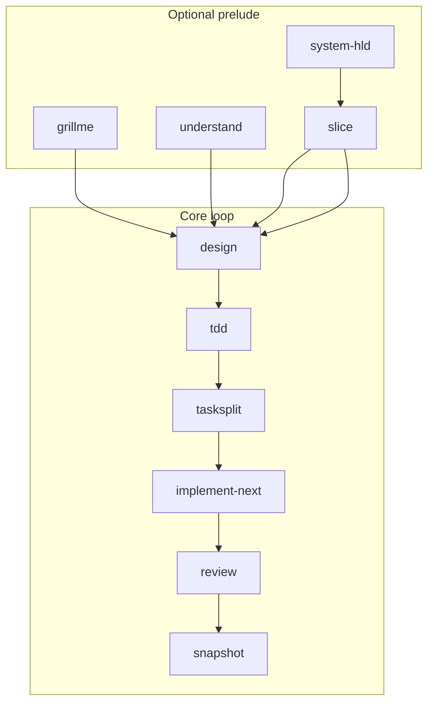

# devflow

A **public, reusable AI engineering workflow framework** for coding agents (Cursor, Claude Code, Codex, Windsurf, Copilot, and compatible tools). It replaces mega-prompts with **bounded skills**, **contract-based handoffs**, and **human approval gates**.

> This repository ships the **framework only** — not a sample application. Attach it to any project and drive work through slash-command skills.

**Documentation index:** [docs/README.md](docs/README.md)  
**Dev Loop:** [docs/DEV_LOOP.md](docs/DEV_LOOP.md)  
**Install & setup:** [docs/GETTING_STARTED.md](docs/GETTING_STARTED.md)

---

## Install (CLI)

The **`devflow-ai`** Python package (`pip install devflow-ai`) attaches the framework to any repository and syncs agent skills for **Cursor**, **Claude Code**, and **GitHub Copilot**.

### What install does

| Step | Repo install (`--scope repo`) | Global install (`--scope global`) |
|------|-------------------------------|-----------------------------------|
| Framework | Copies `core/`, `adapters/` | — |
| Context folder | Creates `<context-dir>/` + seeds `SPEC.md`, `PROJECT_STATE.md`, `contracts/` | — |
| Manifest | Writes `devflow.context.yaml` | — |
| Agent skills | Syncs to `.cursor/`, `.claude/`, or `.github/skills/` | Syncs to `~/.cursor/`, `~/.claude/`, or `~/.copilot/` |
| Paths in skills | Materializes `{context_dir}/` → your folder name | Keeps `{context_dir}/` token (per-repo resolve) |

**Context directory** — where workflow files live (`SPEC.md`, contracts, design docs). **Default: `artifacts/`** if you do not pass `--context-dir` or set an override.

| Override | How |
|----------|-----|
| CLI flag | `--context-dir my-folder` (or `-c`) |
| Repo file | `devflow.context.yaml` → `context_dir: my-folder` |
| Environment | `DEVFLOW_CONTEXT_DIR=my-folder` |

Priority: env → manifest → default **`artifacts`**.

### End-to-end commands

**1. Install the `devflow-ai` CLI** (once per machine, from a clone of this repo):

```powershell
git clone https://github.com/Ranganathvk/devflow
cd devflow
uv sync
```

```bash
git clone https://github.com/Ranganathvk/devflow
cd devflow
uv sync
```

**2. Attach to your application repo** (default context folder `artifacts/`):

```powershell
cd C:\path\to\your-app
uv run --project C:\path\to\devflow devflow-ai install --scope repo
```

Or after `uv sync` inside the devflow repo with venv activated:

```powershell
cd C:\path\to\your-app
devflow-ai install --scope repo
```

Equivalent per-agent form: `devflow-ai cursor install --scope repo`

**3. Custom context folder** (optional — otherwise defaults to `artifacts/`):

```powershell
devflow-ai cursor install --scope repo --context-dir my-workflow
```

**4. Other agents** (same flags):

```powershell
devflow-ai claude install --scope repo
devflow-ai copilot install --scope repo
```

**5. Global skills** (all projects for that agent — no per-repo `SPEC.md`):

```powershell
devflow-ai cursor install --scope global
```

**6. Interactive mode** (prompts repo vs global if you omit `--scope`):

```powershell
devflow-ai cursor install
```

### After install

```text
your-app/
├── devflow.context.yaml      # context_dir: artifacts (or your custom name)
├── artifacts/                # default context folder
│   ├── SPEC.md               # edit this — your product spec
│   ├── PROJECT_STATE.md
│   └── contracts/            # reference schemas (from core/contracts)
├── core/                     # canonical framework (from install)
├── adapters/
└── .cursor/                  # Cursor: AGENTS.md + skills (derived)
    ├── AGENTS.md
    └── skills/
```

1. Edit **`artifacts/SPEC.md`** (or `<your-folder>/SPEC.md` if you used `-c`).
2. Open the repo in Cursor / Claude / VS Code.
3. Run prelude skills as needed: **`/grillme`**, **`/understand`**, …
4. Run the core loop: **`/design`** → **`/tdd`** → **`/tasksplit`** → **`/implement-next`** → **`/review`** → **`/snapshot`**.

**Re-sync** after editing `core/skills/` or `core/AGENTS.md`:

```powershell
devflow-ai cursor install --scope repo
# or: .\path\to\devflow\installer\sync-cursor.ps1
```

### Legacy installer scripts

PowerShell/bash scripts under `installer/` do the same repo attach without the CLI. See [installer/README.md](installer/README.md).

### Clean reinstall

Three layers can be installed independently: the **CLI package**, a **repo attach**, and **global agent skills**.

#### A. Rebuild the CLI (this repo clone)

```powershell
cd C:\path\to\devflow

# Remove old venv + editable install (cleanest)
Remove-Item -Recurse -Force .venv -ErrorAction SilentlyContinue

# Rebuild and install into a fresh venv
uv sync
```

Or uninstall only the package and resync:

```powershell
cd C:\path\to\devflow
uv pip uninstall devflow-ai
uv sync
```

Build a wheel (optional):

```powershell
uv build
# output under dist/
```

Verify:

```powershell
uv run devflow-ai version
```

**Troubleshooting:**

| Error | Fix |
|-------|-----|
| `No such option: --scope` | Old `devflow.exe` on PATH — `uv tool uninstall devflow`, then reinstall `devflow-ai` |
| `Cannot locate framework files (core/)` | Global install missing bundled `core/` — rebuild and reinstall: `uv tool install --force C:\path\to\devflow` |
| Works only with `uv run` | Same as above, or set `DEVFLOW_FRAMEWORK_ROOT=C:\path\to\devflow` |

```powershell
cd C:\path\to\devflow
uv sync
uv tool install --force .
devflow-ai install --scope repo   # should work from any directory
```

From a clone without global install: `uv run devflow-ai install --scope repo`

#### B. Remove framework from an application repo

From the **consumer** repo (not the devflow framework clone), delete install outputs. **Back up** anything you edited (e.g. `artifacts/SPEC.md`) first.

```powershell
cd C:\path\to\your-app

Remove-Item -Recurse -Force core, adapters -ErrorAction SilentlyContinue
Remove-Item -Force devflow.context.yaml -ErrorAction SilentlyContinue
Remove-Item -Recurse -Force .cursor -ErrorAction SilentlyContinue
Remove-Item -Recurse -Force .claude -ErrorAction SilentlyContinue
Remove-Item -Recurse -Force .github\skills -ErrorAction SilentlyContinue
# Only if Copilot install copied harness to repo root and you want it gone:
# Remove-Item -Force AGENTS.md
```

Keep or delete the context folder (`artifacts/` by default) depending on whether you want to preserve `SPEC.md` and contracts.

Reattach:

```powershell
devflow-ai cursor install --scope repo
# add: --context-dir my-folder  if not using default artifacts/
```

#### C. Remove global (user-level) agent skills

```powershell
# Cursor — removes devflow-synced skills and harness (back up if customized)
Remove-Item -Recurse -Force $env:USERPROFILE\.cursor\skills -ErrorAction SilentlyContinue
Remove-Item -Force $env:USERPROFILE\.cursor\AGENTS.md -ErrorAction SilentlyContinue

# Claude Code
Remove-Item -Recurse -Force $env:USERPROFILE\.claude\skills -ErrorAction SilentlyContinue
Remove-Item -Force $env:USERPROFILE\.claude\AGENTS.md -ErrorAction SilentlyContinue

# GitHub Copilot
Remove-Item -Recurse -Force $env:USERPROFILE\.copilot\skills -ErrorAction SilentlyContinue
Remove-Item -Force $env:USERPROFILE\.copilot\AGENTS.md -ErrorAction SilentlyContinue
```

Reinstall global skills:

```powershell
devflow-ai cursor install --scope global
```

#### Full refresh (CLI + your app)

```powershell
# 1. Rebuild CLI
cd C:\path\to\devflow
Remove-Item -Recurse -Force .venv -ErrorAction SilentlyContinue
uv sync

# 2. Clean consumer repo (backup SPEC first!), then reinstall
cd C:\path\to\your-app
devflow-ai cursor install --scope repo
```

---

## Your product spec (`artifacts/SPEC.md`)

All workflows treat **`artifacts/SPEC.md`** as the durable source of truth — not one-off chat text. The context folder name is configurable via **`DEVFLOW_CONTEXT_DIR`** or **`devflow.context.yaml`** (default: `artifacts/`).

| You do | Agent does |
|--------|------------|
| Edit or paste your requirements into `artifacts/SPEC.md` before a session | Reads that file on every skill |
| Attach the file in chat (e.g. `@artifacts/SPEC.md` in Cursor) when invoking a skill | Uses your file as input; does not rely on a vague slash command alone |
| Add a **Current change** section with the feature you want (or let `/understand` help write it) | Updates the same file in place (grill-style Q&A) |

**Existing repo:** put the change in `SPEC.md`, then `/understand` — orientation plus spec refinement and blast-radius notes land back in **`SPEC.md`**.

**New product:** start from `core/templates/SPEC.template.md`; `/grillme` interviews you and keeps refining **`SPEC.md`**.

## Why use it

| Problem | How this framework helps |
|---------|---------------------------|
| AI rewrites legacy code blindly | `/understand` captures layout + conventions from the real repo |
| Giant uncontrolled codegen | `/implement-next` runs **one** task per invocation |
| Context window overload | Skills consume compact `*.contract.yaml`, not full chat history |
| No audit trail for AI plans | `/design` writes `*_DESIGN.md`; `/tasksplit` writes the task queue |
| Architecture drift | `/system-hld` + `/slice` lock system shape before feature work |

---

## Dev Loop

One workflow for all projects. **Optional prelude** skills depend on repo state — pick what you need.

```text
Optional prelude:
  /grillme | /understand | /system-hld | /slice

Core loop (per feature):
  /design <FEATURE> → /tdd → /tasksplit → /implement-next → /review → /snapshot
```



### Which prelude to run

| Situation | Start with |
|-----------|------------|
| Spec vague or empty | `/grillme` |
| Existing codebase | `/understand` + `@artifacts/SPEC.md` |
| New product / system shape | `/grillme` → `/system-hld` → `/slice` |
| Large multi-part change | `/slice` after orientation or HLD |

### Core commands

| Command | What it does |
|---------|----------------|
| `/design <FEATURE>` | Per-feature design (incremental or bundled) |
| `/tdd <FEATURE>` | Test cases after design approved |
| `/tasksplit <FEATURE>` | Task queue `FEATURE:Cn` |
| `/implement-next` | Next pending task |
| `/review` / `/snapshot` | Human-owned verification |

### Approval gates

1. **Design** — Approve stages in chat; `design_status: approved` before `/tdd`.
2. **Tasks** — `tasks_status: approved` on `<FEATURE>_TASKS.contract.yaml` before `/implement-next`.
3. **Task** — Review signoff before `/snapshot`.

### Example (existing repo)

```text
/understand @artifacts/SPEC.md
/design OTP_LOGIN
# approved (per stage)
/tdd OTP_LOGIN
/tasksplit OTP_LOGIN
# tasks approved
/implement-next → /review → /snapshot
```

Detail: [docs/DEV_LOOP.md](docs/DEV_LOOP.md). Existing-repo principles: [docs/DELTA_PRINCIPLES.md](docs/DELTA_PRINCIPLES.md).

---

## Quick start (Cursor)

```powershell
cd C:\path\to\your-app
devflow-ai install --scope repo
```

1. Edit **`artifacts/SPEC.md`**; attach **`@artifacts/SPEC.md`** and run prelude skills as needed (`/understand`, `/grillme`, …).
2. **`/design <FEATURE>`** → approve → **`/tdd`** → **`/tasksplit`** → approve tasks.
3. Loop **`/implement-next`** → **`/review`** → **`/snapshot`** until the queue is empty.

Full install options: [Install (CLI)](#install-cli) above. Skills live under `.cursor/skills/` after install (synced from `core/skills/`).

---

## Slash commands (full list)

See [core/skills/README.md](core/skills/README.md). Canonical sources: [`core/skills/`](core/skills/). After editing, run **`installer/sync-cursor.ps1`**.

---

## Repository map

```text
devflow/
├── devflow.context.yaml  # context_dir (default: artifacts)
├── artifacts/            # workflow context (configurable)
│   └── SPEC.md           # Your product spec — edit or @-attach in chat
├── devflow_ai/           # Python CLI package (PyPI: devflow-ai)
├── core/
│   ├── AGENTS.md         # Canonical agent harness (edit here)
│   ├── skills/           # Canonical SKILL.md modules
│   ├── templates/
│   ├── contracts/
│   └── hooks/
├── adapters/
├── installer/
├── docs/                 # DEV_LOOP, GETTING_STARTED, …
└── examples/
```

**Rule:** Edit **`core/`** only. Run **`installer/sync-cursor.ps1`** to refresh `.cursor/`. See [CONTRIBUTING.md](CONTRIBUTING.md).

## Multi-agent support

| Agent | Adapter notes |
|-------|----------------|
| Cursor | [adapters/cursor/README.md](adapters/cursor/README.md) |
| Claude Code | [adapters/claude/README.md](adapters/claude/README.md) |
| Codex | [adapters/codex/README.md](adapters/codex/README.md) |
| Windsurf | [adapters/windsurf/README.md](adapters/windsurf/README.md) |
| Copilot | [adapters/copilot/README.md](adapters/copilot/README.md) |

## Design principles

1. **No mega prompts** — small composable skills  
2. **Files over chat** — plans and contracts in `artifacts/`  
3. **Human code ownership** — explicit approval before implement; review before snapshot  
4. **Delta thinking** — smallest safe change, match existing conventions ([DELTA_PRINCIPLES.md](docs/DELTA_PRINCIPLES.md))  
5. **Contract-based handoff** — human doc + `.yaml` contract per stage  
6. **Vertical tasks** — one `FEATURE:Cn` at a time  

## Status

**v1** — Dev Loop, CLI (`devflow-ai cursor|claude|copilot install`), and multi-agent sync are in place. See [artifacts/SPEC.md](artifacts/SPEC.md).

## Contributing

See [CONTRIBUTING.md](CONTRIBUTING.md).

## License

[MIT](LICENSE)
