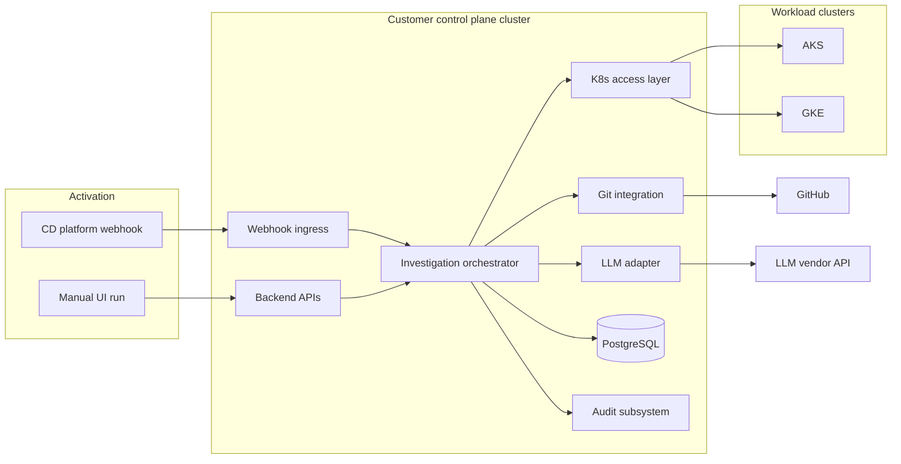

# System — High-level design

## Context & scope

The **DevOps AI Agent** is a **customer-operated** control plane that activates **after continuous deployment completes** (authenticated HTTPS webhook) or when an engineer **starts an investigation manually** from the chat UI. It connects to **AKS** and **GKE** workloads using **administrator-supplied cluster credentials**, correlates live Kubernetes state with **Git-backed deployment intent**, and uses a **third-party LLM** to explain failures and propose fixes. **Mutating cluster actions** and **Git writes** (branch push, PR open/update) occur only after **approver-gated** confirmation inside the product.

**In scope (v1):** webhook + manual activation; admin dashboard for users/roles, applications, cluster registration, and webhook→target mappings; deployment verification (read-only comparison vs expectations); structured stdout logs; PostgreSQL persistence; Helm install with **single backend replica** default.

**Hard boundaries (from SPEC):** no vendor-hosted multi-tenant SaaS control plane v1; no Docker Compose / non-K8s install v1; no horizontal scaling / HA across backend replicas v1 unless explicitly added; no Prometheus metrics / OpenTelemetry / scrape model v1; SQLite and non-PostgreSQL stores out of scope v1; self-hosted LLM out of scope v1 unless explicitly added; OIDC/SSO deferred post–v1.

## Stakeholders & actors

| Actor | Role |
|-------|------|
| **DevOps engineer** | Operates clusters; runs investigations; may hold approver or viewer capabilities per admin assignment. |
| **Backend / service owner** | Consumes diagnoses and verification answers; may propose context; approval per role. |
| **Administrator** | Configures local users and roles, applications, cluster credentials, GitHub token, LLM settings, webhook mappings, and policies (retention/redaction TBD in implementation). |
| **Approver** | Explicitly authorizes gated cluster commands and Git push/PR steps after reviewing proposals/diffs in-product. |
| **Viewer (non-approver)** | Observes runs, reads output, prepares context; **cannot** approve gated execution or trigger agent-driven Git writes. |
| **External CD platform** | HTTPS POST to inbound webhook using documented vendor-neutral JSON contract; authenticated. |
| **GitHub** | Target for branch push and PR lifecycle using admin-configured PAT; merge and redeploy follow normal repo/CD process. |
| **LLM vendor** | Inference over HTTP API; receives minimized/redacted prompts only per product rules. |

## Logical components

The following are **logical** boundaries (not implementation packages). Names describe responsibilities, not repo layout.

1. **Edge / ingress** — Terminates TLS for customer cluster ingress; routes traffic to backend (and static SPA assets per chart). May sit behind customer API gateway.
2. **Chat & run API** — Authenticated HTTP API for session/run lifecycle, streaming or polling semantics as implemented; WebSocket or equivalent for chat streams (SPEC: HTTP and/or WebSocket TBD).
3. **Admin API** — Authenticated configuration surface for users, roles, applications, cluster attachments, webhook→Kubernetes target mappings, GitHub/LLM/global settings (IA TBD).
4. **Authentication service** — Local user accounts (registration/password rules TBD); session issuance for SPA; foundation for future OIDC (deferred).
5. **Authorization / policy engine** — Enforces viewer vs approver constraints on gated actions and Git writes; ties capabilities to administrator-defined targets and mappings.
6. **Webhook ingress** — Validates authentication (shared secret or signature verification — implementation detail); parses vendor-neutral payload; resolves **admin-configured mapping** to cluster + namespace/workload scope (payload fields are not authoritative targets unless they resolve to a mapping).
7. **Investigation orchestrator** — Drives a **run**: scope resolution (CD vs manual), signal collection plan, deployment verification when requested, diagnosis prompts to LLM adapter, proposal assembly (cluster commands, Git diffs).
8. **Kubernetes access layer** — Executes **read-only** queries within investigation scope; executes **mutating** calls only when backed by an approved step or approved playbook; uses credentials stored **encrypted at rest**. **Assumption:** runtime uses standard Kubernetes API patterns compatible with supplied kubeconfig/token-style material.
9. **Git integration layer** — Computes diffs against deployment files in GitHub repos; after approver confirmation, pushes branch and opens/updates PR using encrypted PAT; does not merge unless product settings ever allow a narrower exception (default: no bypass of merge review).
10. **LLM adapter** — Provider/model configuration from admin; applies **redaction and minimization** before outbound inference; no self-hosted inference v1 unless explicitly added later.
11. **Deployment verification engine** — Compares gathered **read-only** cluster state to user-stated expectations and/or **admin-defined hints** (storage/UX TBD); emits pass/fail/partial with evidence references (kinds, namespaces, field paths).
12. **Audit & retention subsystem** — Persists rich per-run records including approvals, proposals, executed commands, Git refs; applies redaction/truncation and retention per policy (retention limits TBD).

## Data & control flows

**Typical CD-triggered run:** CD POST → authenticate webhook → select mapping → persist run → gather scoped K8s state (logs, events, status) → optional verification pass → optional LLM diagnosis → present proposals → **approver gate** → conditional mutate cluster / push branch & PR → record audit.

**Manual run:** Same orchestration path after user selects admin-defined target (and optional context TBD).

**Verification-only path:** Read-only K8s reads within scope; comparison to expectations/hints; remediation remains gated separately.

## Integrations & external dependencies

| Dependency | Purpose | Notes |
|------------|---------|--------|
| **Customer ingress / TLS** | Expose webhook and UI | Customer-operated. |
| **AKS / GKE API** | Observation and gated remediation | Credentials admin-supplied; RBAC/rotation operator responsibility unless product adds UX later. |
| **GitHub (HTTPS)** | Clone/fetch context, push branch, PR API via PAT | PAT admin-configured; GitHub App migration noted as future hardening in SPEC. |
| **LLM vendor HTTP API** | Reasoning and narrative diagnosis | Encrypted credentials; customer accepts vendor terms; data crosses customer boundary here. |
| **PostgreSQL** | Durable users, config, runs, audit | Customer-managed or in-cluster via chart options TBD. |
| **Kubernetes (host cluster)** | Runs Helm-deployed workloads | Product cluster separate from diagnosed workload clusters. |

**Assumption:** Reference docs and sample payloads for GitHub Actions / Deployments are documentation artifacts only; runtime does not depend on GitHub-specific deployment APIs.

## Deployment / topology view (conceptual)

- **Two-plane mental model:** (A) **control plane** — Helm-installed product in **customer’s own cluster**; (B) **workload plane(s)** — one or many AKS/GKE clusters registered **per application**, reachable from the control plane over customer network paths.
- **Scale:** Default **single replica** backend API workload in v1 for simpler orchestration and WebSocket/session semantics; multi-replica HA explicitly out of scope v1 unless added later.
- **SPA:** Delivered with backend via chart (e.g. React/Vite); static assets via ingress/controller setup.
- **Data residency:** Operational DB, secrets store, paths to workload clusters and GitHub remain **inside customer boundary** except LLM API egress.

## Cross-cutting concerns

- **Security:** Authenticated webhook; authenticated chat UI; role separation for approvals; secrets encrypted at rest; minimization before LLM egress.
- **Compliance / safety:** Gated execution for mutations; audit trail for forensic reconstruction; deployment verification avoids assuming readability of secret values.
- **Operability:** Structured logs to stdout/stderr for customer log stack (format TBD); no metrics/tracing v1.
- **Configuration lifecycle:** Admin dashboard as primary operator surface — no raw DB/CLI for normal operations (SPEC invariant).

## Risks & tradeoffs

| Risk / tension | Mitigation | Residual |
|----------------|------------|----------|
| Incorrect LLM diagnosis could still lead to harmful **approved** cluster/Git actions | Evidence-linked outputs; explicit per-change or per-playbook approval; viewer cannot approve | Residual operational risk if approver rubber-stamps; product cannot eliminate human judgment errors. |
| **Secret leakage** to LLM or chat via logs/events/env | Redaction/minimization rules (TBD); verification focuses on keys/refs/digests where possible; customer policy hooks | Until rules are concrete, residual ambiguity on edge cases (verbose errors, third-party images). |
| **Single backend replica** — availability and upgrade windows | Accept as v1 scope; clear ops guidance for upgrades/backups TBD | No HA within v1 boundary without scope change. |
| **Webhook authenticity** — forged or replayed payloads | Auth mechanism (secret/signature); mappings only to preconfigured targets; no arbitrary payload→cluster binding | Customer must protect shared secrets and network ingress posture. |
| **Audit growth** vs retention/privacy | Retention limits TBD; configurable redaction/truncation | Disk and policy tuning unresolved until implementation specifies limits. |
| **Cluster credential longevity** | Operator-led rotation and least-privilege RBAC per SPEC | Product does not enforce rotation v1 unless UX added later. |

## Spec traceability

| SPEC reference | Addressed in |
|----------------|--------------|
| Summary (mission, webhook + manual, AKS/GKE, verification, Git diffs, gated remediation) | Context & scope; Logical components; Data & control flows |
| Execution policy (cluster gated execution; Git default PR path) | Context & scope; Kubernetes access layer; Git integration layer |
| Activation (CD webhook, manual UI) | Webhook ingress; Chat & run API; triggers in diagram |
| Admin dashboard (people, applications, clusters) | Admin API; Stakeholders |
| Cluster access (credentials, encrypted at rest) | Kubernetes access layer; Integrations |
| GitHub access (PAT, encrypted, scoped) | Git integration layer; Integrations |
| Investigation scope (mappings vs arbitrary payload) | Webhook ingress; Authorization/policy |
| Deployment verification (signals, read-only, gated fixes) | Deployment verification engine; Risks |
| CD integration (vendor-neutral contract, GitHub as reference example) | Webhook ingress; Integrations Assumption |
| AI / inference (HTTP LLM, redaction; no self-hosted v1) | LLM adapter; Cross-cutting |
| Authorization / Authentication (local accounts; approver vs viewer; OIDC deferred) | Stakeholders; Auth service; Authorization engine |
| Deployment topology (Helm, customer cluster, single replica, no SaaS v1) | Deployment topology |
| Persistence (PostgreSQL; SQLite out of scope) | Audit subsystem; Integrations |
| Audit / retention | Audit subsystem; Risks |
| User interface (SPA + Python backend) | Edge; Chat & run API |
| Observability (structured logs only v1) | Cross-cutting |
| FR: Deployment through SPA chat item | Logical components 2–3, 7 |
| FR items in Functional requirements section (bullets 127–141) | Mapped across Logical components and flows |

## Open design questions

Items explicitly **TBD** or **implementation-detail** in SPEC — require `/grillme`, design spikes, or human review before implementation contracts freeze:

- Exact webhook JSON schema keys used for mapping resolution vs correlation IDs.
- Webhook authentication mechanism details (header names, signature algorithm, rotation).
- Password rules and registration flows for local accounts.
- Additional roles beyond viewer/approver (e.g. admin-only settings) and naming.
- Namespace/workload selection UX and storage model for hints used in deployment verification.
- Concrete redaction/minimization rules and policy knobs for logs/events/manifest snippets sent to LLM.
- Helm chart structure, values schema, optional Postgres subchart vs external DB.
- Streaming protocol choice (WebSocket vs SSE vs pure HTTP) and session affinity implications given single replica.
- Retention limits defaults and administrator controls for audit and stored webhook bodies.
