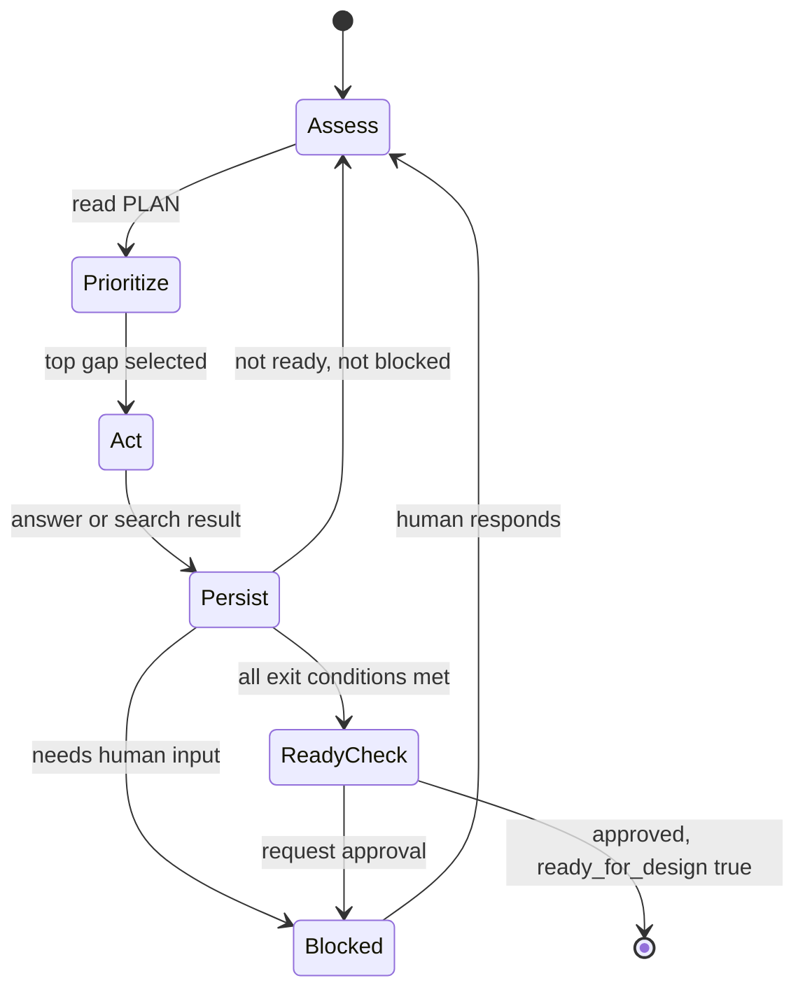

# /understand [\<FEATURE\> | "\<description>"]

## Purpose

**One command** — a **state machine**, not a single prompt — for disciplined investigation before design on **existing codebases**.

Goal: acquire **just enough context** to safely run `/design <FEATURE>`. The agent never tries to understand the whole repository; it closes gaps one at a time until the feature is **Ready for Design**.

Downstream: **`/design <FEATURE>`**.

Do **not**:

- Scan or summarize the whole repository
- Generate architecture documentation or knowledge graphs
- Dump layout or conventions as separate artifacts (close those gaps with targeted search)
- Implement features or chain `/design` in the same invocation

## When to invoke

| Invocation | When |
|------------|------|
| `/understand` | New change — agent asks what to investigate; derives `<FEATURE>` |
| `/understand <FEATURE>` | Continue the loop from persisted PLAN state |
| `/understand "add OTP login"` | Propose `<FEATURE>` id; seed PLAN; enter the loop |

- Use on **existing codebases** when preparing a bounded change.
- Do **not** use when starting from an empty spec with no repo — use `/grillme` first.
- Do **not** implement — use `/design` → `/tdd` → `/tasksplit` → `/implement`.

## Inputs

- **Required:** Consumer repository (for targeted search when tools available).
- **Optional:** `{context_dir}/SPEC.md` — product-level intent only; do not rewrite unrelated sections.
- **State (continue mode):** `{context_dir}/<FEATURE>_PLAN.md` + `{context_dir}/<FEATURE>_PLAN.contract.yaml` — **read first every turn**.
- **Forbidden:** Unbounded chat as requirements; whole-repo dumps; editing application source; inventing paths without evidence.

---

## Core loop (every turn)

`/understand` is a **repeatable state machine**. Each turn executes exactly this sequence:

```text
1. ASSESS   — Read persisted PLAN + contract; summarize what is already known.
2. PRIORITIZE — Pick the single highest-priority missing gap (see gap categories).
3. ACT      — One focused question OR one targeted repo/IDE search (never both, never many).
4. PERSIST  — Merge results into PLAN.md + PLAN.contract.yaml; update progress tracker.
5. TRANSITION — If ready_for_design: request human approval. Else: continue loop or STOP if blocked.
```



**Loop rules**

- **Persist every turn** — never keep state only in chat. After step 4, `{context_dir}/<FEATURE>_PLAN.md` and `.contract.yaml` must exist and reflect current knowledge (draft is fine).
- **One action per turn** — one question *or* one search, not a list.
- **Continue within a session** when the agent can act autonomously (has search tools and no human-only gap). Run multiple loop iterations in one invocation when unblocked.
- **STOP only when:**
  - waiting on human input (answer, approval, or IDE paste), or
  - `ready_for_design: true` and human has approved → hand off to `/design`.
- Do **not** STOP after an arbitrary "phase" — only on block or completion.

---

## Step 1 — Assess (read state)

At the **start of every turn**:

1. Ensure `{context_dir}/` exists.
2. Load `{context_dir}/<FEATURE>_PLAN.md` and `{context_dir}/<FEATURE>_PLAN.contract.yaml` if present; else seed empty skeleton (see [Output artifacts](#output-artifacts)).
3. Optionally skim `{context_dir}/SPEC.md` for product intent — do not rewrite it.
4. Summarize internally (and briefly in chat if useful): what is **known**, what is **unknown**, what is **blocked on human**.

The PLAN files are the **source of truth** for investigation state — not chat history.

---

## Step 2 — Prioritize (pick one gap)

Scan [gap categories](#gap-categories) in **priority order**. Select the **first category** that still has an open, blocking gap. Within that category, pick the **single most important** missing piece.

**Priority order** (highest first — do not skip a higher category while it has blocking gaps):

| Priority | Category | Blocking until |
|----------|----------|----------------|
| P0 | **Intent** | Problem statement + business goal confirmed by human |
| P1 | **Entry points** | At least one evidence path for how the change enters the system (API, handler, job, CLI) |
| P2 | **Ownership** | Service/module responsible is identified with evidence path |
| P3 | **Scope** | In-scope and out-of-scope boundaries stated |
| P4 | **Dependencies** | Critical integrations/dependencies on the change path have evidence or explicit unknown |
| P5 | **Patterns** | ≥1 analogous implementation cited, or explicit "none found" after search |
| P6 | **Constraints** | Blocking constraints (compat, security, migration) captured or confirmed none |
| P7 | **Risks** | Material risks named or explicitly none |
| P8 | **Open questions** | No unresolved blocking questions remain (non-blocking may remain with human ack) |

If two gaps tie, prefer the one **closer to the change entry point** (intent → code → patterns → constraints).

State the chosen gap in chat:

```text
Highest-priority gap: <category> — <one-line description of what is missing>
```

---

## Step 3 — Act (one question or one search)

Choose **exactly one** action type for this turn.

### A — Focused question

Use when the gap requires human knowledge (intent, constraints, approval, business rules).

- One question only.
- Include a **recommended** answer when choices are fixed.
- Do not ask broad questions ("tell me about the architecture").

### B — Targeted search

Use when the gap can be closed by repo/IDE evidence.

- Pick one template from the [investigation prompt library](#investigation-prompt-library).
- **Agent has search tools** → run the search, record evidence paths.
- **Agent lacks repo access** → emit the prompt block and **STOP** for human paste.

```text
Objective
  <what we need to learn>

Suggested Search
  <symbol, endpoint, class name, or grep pattern>

Expected Output
  • <concrete item>
  • <concrete item>

Next Step
  Share the results here.
```

**Never** combine multiple questions or searches in one turn.

---

## Step 4 — Persist (update PLAN)

After every act — success, partial result, or new unknown — **write files**:

1. Update `{context_dir}/<FEATURE>_PLAN.md` sections affected by new knowledge.
2. Update `{context_dir}/<FEATURE>_PLAN.contract.yaml`:
   - `progress.*` booleans
   - `evidence_paths`, `patterns`, `constraints`, `risks`, `open_questions`
   - `understand_status: draft` until approved
3. Refresh `{context_dir}/UNDERSTAND.contract.yaml` rollup (minimal pointer to current PLAN).

Show the [progress tracker](#progress-tracker-every-turn) in chat after persist.

---

## Step 5 — Transition (continue, block, or complete)

| Condition | Next |
|-----------|------|
| All [exit conditions](#exit-conditions-ready-for-design) met | Ask human to review PLAN; request approval; on approval set `ready_for_design: true`, `understand_status: ready` |
| Human input required | **STOP** — state is persisted; resume with `/understand <FEATURE>` |
| Gaps remain, agent can act | Return to **Step 1** (next loop iteration) |
| Search failed | Record in `unknowns` / `open_questions`; pick alternate search next turn or ask human |

**Completion STOP message:**

```text
Understanding complete for <FEATURE>.

Review: {context_dir}/<FEATURE>_PLAN.md

When satisfied, run:
  /design <FEATURE>
```

---

## Gap categories (reference)

Categories map to PLAN sections — the loop pulls from these dynamically, not in a fixed session-long phase.

| Category | PLAN sections | Typical actions |
|----------|---------------|-----------------|
| Intent | Feature summary, Business goal | Clarifying questions; confirm ACs |
| Entry points | Relevant files (handlers, routes) | Locate API / service search |
| Ownership | Relevant components | Locate service search |
| Scope | Scope in/out | Questions + evidence from entry files |
| Dependencies | Dependencies and integrations | Locate integration search; trace imports/callers |
| Patterns | Existing patterns to reuse | Locate similar implementation search |
| Constraints | Constraints | Questions on compat, security, perf, deploy, migration |
| Risks | Risks, Unknowns | Questions + evidence from change path |
| Open questions | Open questions | Resolve or explicitly defer with human ack |

---

## Exit conditions (Ready for Design)

All must be true before requesting approval:

- [ ] `progress.problem_statement` and `progress.business_goal` — human confirmed
- [ ] `progress.domain` and `progress.components` — evidence-backed (not guessed)
- [ ] Every in-scope component has an `evidence_paths` entry **or** an `open_questions` entry marked blocking
- [ ] `progress.existing_patterns` — ≥1 pattern cited **or** search attempted and "none found" recorded
- [ ] `progress.constraints` — blocking constraints captured or confirmed none
- [ ] `progress.risks` — material risks listed or explicitly none
- [ ] No `open_questions` with `blocking: true` remain unresolved

Set `ready_for_design: true` in the contract **only after explicit human approval** of the PLAN.

---

## Progress tracker (every turn)

Show after Step 4 (persist):

```text
Understanding Progress — <FEATURE>

✓ Problem Statement      ◯ or ✓
✓ Business Goal          ◯ or ✓
◯ Domain
◯ Components
◯ Existing Patterns
◯ Constraints
◯ Risks
◯ Ready for Design

Current gap: <category> — <one line>
Loop: assess → prioritize → act → persist
```

Mark ✓ only when evidence-backed or human-confirmed per exit conditions.

---

## Investigation prompt library

Substitute concrete names from PLAN intent sections.

### Locate API

```text
Objective: Identify the HTTP/RPC handler for <capability>.
Suggested Search: <route, controller name, or OpenAPI operationId>
Expected Output: handler file, route registration, request/response types
Next Step: Share the results here.
```

### Locate service

```text
Objective: Identify the service/module responsible for <capability>.
Suggested Search: <ServiceName or domain keyword>
Expected Output: class/module names, package path, primary entry file
Next Step: Share the results here.
```

### Locate database

```text
Objective: Find where <entity/concept> is persisted.
Suggested Search: <EntityName, table name, repository interface>
Expected Output: entity/model, repository, migration or schema file
Next Step: Share the results here.
```

### Locate similar implementation

```text
Objective: Find an existing feature analogous to <requested change>.
Suggested Search: <similar feature name or endpoint>
Expected Output: files implementing the analogous flow end-to-end
Next Step: Share the results here.
```

### Locate integration

```text
Objective: Find how the system integrates with <external system/queue>.
Suggested Search: <client class, adapter, topic name>
Expected Output: client/adapter file, config, call sites
Next Step: Share the results here.
```

### Locate configuration

```text
Objective: Find configuration for <feature/flag/env>.
Suggested Search: <env var, feature flag key, config key>
Expected Output: config file, default values, where loaded
Next Step: Share the results here.
```

---

## Output artifacts

Written to the **consumer project's** `{context_dir}/`:

| Path | When |
|------|------|
| `{context_dir}/<FEATURE>_PLAN.md` | **Every turn** after Step 4 (seed on first turn) |
| `{context_dir}/<FEATURE>_PLAN.contract.yaml` | **Every turn** after Step 4 |
| `{context_dir}/UNDERSTAND.contract.yaml` | **Every turn** — rollup pointer |

### `<FEATURE>_PLAN.md` skeleton

Target **≤ ~150 lines**. PLAN = *what exists and what is affected* — not a design doc.

```markdown
# <FEATURE> — understanding plan

## Feature summary
## Business goal
## Scope
### In scope
### Out of scope
## Affected domains
## Relevant components
## Relevant files
<!-- evidence paths only; no invented paths -->
## Existing patterns to reuse
## Dependencies and integrations
## Constraints
## Risks
## Unknowns
## Open questions
## Readiness
<!-- ready for /design when human approves -->
```

### `<FEATURE>_PLAN.contract.yaml` shape

```yaml
contract_version: "1"
artifact: feature_plan
workflow_profile: devflow
feature_id: "<FEATURE>"
title: "<short title>"
understand_status: draft | ready
completed_at: "YYYY-MM-DD"

summary: "<one paragraph; update each persist>"

progress:
  problem_statement: false
  business_goal: false
  domain: false
  components: false
  existing_patterns: false
  constraints: false
  risks: false
  ready_for_design: false

evidence_paths: []
  # - path: "src/..."
  #   role: "handler | service | repo | config | test | other"
  #   notes: "..."

patterns: []
  # - id: PAT-001
  #   summary: "..."
  #   evidence_paths: ["..."]

constraints: []
  # - id: CON-001
  #   category: compat | security | performance | deploy | migration | other
  #   summary: "..."
  #   blocking: false

risks: []
open_questions: []
  # - id: Q-001
  #   question: "..."
  #   blocking: true

ready_for_design: false

downstream_skills:
  - design
```

### `UNDERSTAND.contract.yaml` rollup (minimal)

```yaml
contract_version: "1"
artifact: understand
workflow_profile: devflow
completed_at: "YYYY-MM-DD"

feature_plan_contract_path: "{context_dir}/<FEATURE>_PLAN.contract.yaml"
feature_plan_path: "{context_dir}/<FEATURE>_PLAN.md"

summary: "<FEATURE> — one-line state>"

open_gaps: []

downstream_skills:
  - design
```

## Feature ID rules

- Derive from description: `^[A-Z][A-Z0-9_]{1,31}$` (e.g. `"add OTP login"` → `OTP_LOGIN`).
- Propose to human on first use; reuse existing id when `{context_dir}/<FEATURE>_PLAN.*` exists.

## Failure handling

- **Change too vague** — P0 Intent gap only; one clarifying question; persist partial PLAN; do not invent paths.
- **Search returns nothing** — persist under `unknowns`; next turn pick alternate search or ask human.
- **Investigation blocked** — persist current state; **STOP** with specific ask; resume via `/understand <FEATURE>`.
- **Missing `{context_dir}/`** — create before first persist.

## Forbidden

- Whole-repo layout or conventions dumps as separate skills.
- Keeping investigation state only in chat without persisting PLAN.
- Feature design, TDD, tasksplit, implementation, review.
- Chaining `/design`, `/tdd`, or `/implement` in the same run.
- Knowledge graphs, vector DBs, or whole-repo parsing platforms.

## Quality bar

- [ ] Every turn: read PLAN → pick top gap → one action → persist PLAN.
- [ ] Progress tracker and current gap shown after persist.
- [ ] One question **or** one search per turn — never a laundry list.
- [ ] Every claimed component has evidence path or blocking open question.
- [ ] `ready_for_design` set only after exit conditions + human approval.
- [ ] STOP only when blocked on human or investigation complete.

## Advanced

| Need | Use |
|------|-----|
| Full product spec interview | `/grillme` |
| Large multi-feature scope | `/slice` |
