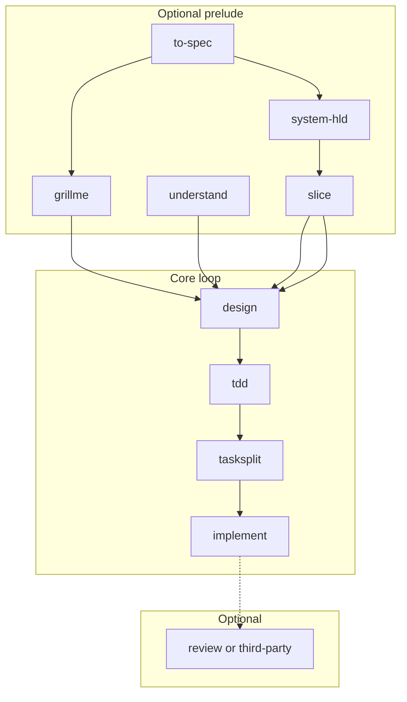

# Dev Loop

Canonical workflow for **devflow**. One loop for all projects — optional prelude skills depend on **repo state**, not a workflow category.

Doc index: [README.md](README.md). Install: [GETTING_STARTED.md](GETTING_STARTED.md).

## Overview

```text
Optional prelude (pick what you need):
  /to-spec | /grillme | /understand | /system-hld | /slice

Core loop (per feature):
  /design <FEATURE> → /tdd → /tasksplit → /implement
```



## Which prelude skills to run

| Situation | Run |
|-----------|-----|
| Requirements doc / PRD draft already exists | `/to-spec <path>` → then `/grillme` if still thin |
| Spec empty or vague (no source doc) | `/grillme` |
| Existing codebase | `/understand` (attach `@artifacts/SPEC.md`) |
| New product or major system shape | `/to-spec` or `/grillme` → `/system-hld` → `/slice` |
| Large multi-feature change | `/slice` (after `/understand` or `/system-hld`) |
| Small focused change in known repo | `/understand` → `/design <FEATURE>` |

## Core commands

| Command | Purpose |
|---------|---------|
| `/design` | Ask what to design; derive feature ID |
| `/design <FEATURE>` | Staged design — classifies db/api/tasks; conditional DB/API artifacts |
| `/design <FEATURE> approved` | Approve current stage and continue |
| `/tdd <FEATURE>` | Test cases `TC-*` after `design_status: approved` |
| `/tasksplit <FEATURE>` | Task queue `FEATURE:Cn` |
| `/implement` | Next pending task (one approved queue) |
| `/implement <FEATURE>` | Next task for that feature, or lite if no queue |
| `/implement <TASK_ID>` | That task only |

## Approval gates

1. **Design** — Per-stage approval for incremental design; whole-design `design_status: approved` before `/tdd`.
2. **Tasks** — `tasks_status: approved` on `<FEATURE>_TASKS.contract.yaml` before queued `/implement`.
3. **Code quality** — human-owned (tests, PR, `/review`, or a third-party review skill). **Not** a queue gate.

## Per-feature loop

```text
/design AUTH
# approved
/tdd AUTH
/tasksplit AUTH
# tasks approved
/implement
# optional: /review AUTH:C1  or  Ponytail / other review skill
/implement
```

## Lite route

When `/design` sets `delivery.needs_tasks: false`, skip the queue and use `/implement <FEATURE>`, or keep a single `FEATURE:C1` from `/tasksplit`.

## Artifacts

| Phase | Files |
|-------|--------|
| Spec | `artifacts/SPEC.md` |
| Orientation | `<FEATURE>_PLAN.*`, `UNDERSTAND.contract.yaml` |
| System shape | `SYSTEM_HLD.*`, `FEATURE_SLICES.*` |
| Feature | `<FEATURE>_DESIGN.md`, `<FEATURE>.contract.yaml`, optional `_DB`, `_API`, `_QUESTIONS`, `_RESEARCH` |
| Tests / queue | `<FEATURE>_TDD.*`, `<FEATURE>_TASKS.*` |
| Per task (optional) | `<FEATURE>_C<n>_REVIEW.*` if `/review` is used |
| Working tree (optional) | `SECURITY_REVIEW.*` if `/security-review` is used |

## Advanced (optional)

- `/review` — optional Devflow checklist
- `/security-review` — optional uncommitted-change security scan (linters / SAST + semantic)
- `/learn` — optional

Existing-repo principles: [DELTA_PRINCIPLES.md](DELTA_PRINCIPLES.md). Old names (`/plan-feature`, `/feature-*`) → **`/design`**.
