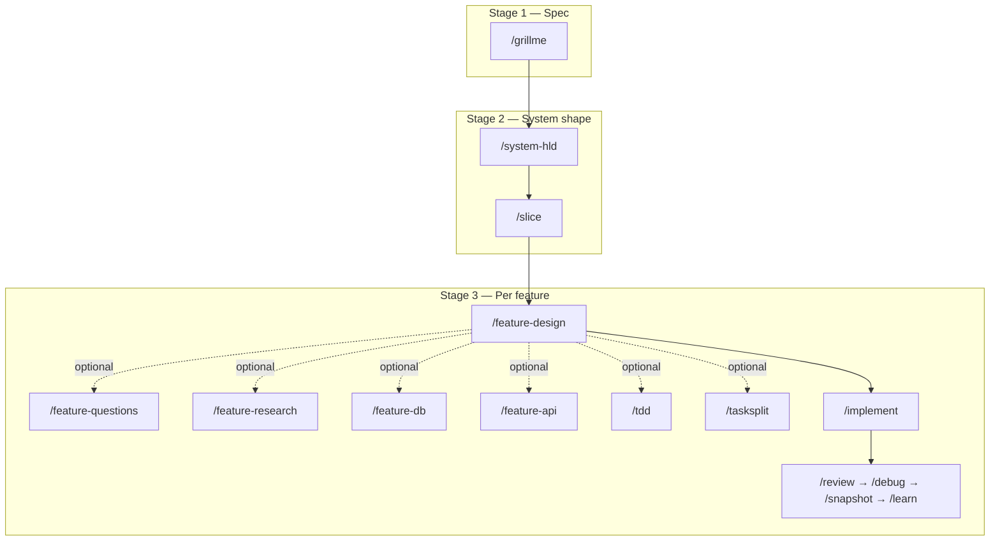

# Getting started

This guide walks through using **agentic-dev-os** in a real project with **Cursor**. Other agents (Claude Code, Codex, Windsurf, Copilot) follow the same `core/` sources; adapter notes live under `adapters/<agent>/`.

## What you get

- **Bounded skills** (`/grillme`, `/system-hld`, `/implement`, …) instead of mega-prompts
- **Vertical feature delivery** — one slice end-to-end, not “all DB then all APIs”
- **Contract handoffs** — compact `*.contract.yaml` files downstream skills consume
- **Human ownership** — review → snapshot on every Simple Dev Loop task (legacy path adds `/debug`, `/learn`)

Full product definition: [AI_CONTEXT/SPEC.md](../AI_CONTEXT/SPEC.md).

## Brownfield Dev Loop (existing repos)

Same command shape as greenfield after orientation:

```text
/understand [change] → optional /slice → /design FEATURE → /tdd → /tasksplit → /implement-next → /review → /snapshot
```

See **[BROWNFIELD_DEV_LOOP.md](BROWNFIELD_DEV_LOOP.md)**. **New products:** **[GREENFIELD_DEV_LOOP.md](GREENFIELD_DEV_LOOP.md)** (`/grillme` → `/system-hld` → `/slice` → …).

## Option A — Use this framework repo as a template

1. **Clone** this repository (or use it as a GitHub template).
2. Open the repo in **Cursor**. Skills are under `.cursor/skills/` (synced from `core/skills/`).
3. Replace placeholders in `AI_CONTEXT/SPEC.md` with your product, or start a session with **`/grillme`** to interview-fill the spec.
4. Run the **locked workflow** (below) stage by stage.

## Option B — Attach to an existing repository

From PowerShell (Windows):

```powershell
git clone https://github.com/YOUR_ORG/agentic-dev-os.git
cd your-existing-app
..\agentic-dev-os\installer\install.ps1 -TargetPath .
```

From bash (macOS / Linux):

```bash
git clone https://github.com/YOUR_ORG/agentic-dev-os.git
cd your-existing-app
chmod +x ../agentic-dev-os/installer/install.sh
../agentic-dev-os/installer/install.sh .
```

The installer:

- Copies `core/` and `adapters/` into your repo
- Creates `AI_CONTEXT/` and seeds `SPEC.md` / `PROJECT_STATE.md` from templates if missing
- Syncs `core/` → `.cursor/` for Cursor

Then run **`/understand`** on a brownfield app, or **`/grillme`** on a greenfield product.

## Greenfield Dev Loop (cheat sheet)

```text
/grillme → /system-hld → /slice → /design AUTH → /tdd AUTH → /tasksplit AUTH → /implement-next → /review → /snapshot
```

Full guide: [GREENFIELD_DEV_LOOP.md](GREENFIELD_DEV_LOOP.md).

## Greenfield workflow — legacy detail (cheat sheet)



| Stage | Command | When |
|-------|---------|------|
| 1 | `/grillme` | Spec is empty, vague, or changed materially |
| 2 | `/system-hld` | Spec is concrete enough to bound architecture |
| 2 | `/slice` | After HLD — decompose vertical features |
| 3 | `/feature-design AUTH` | Non-trivial feature — sets delivery flags |
| 3 | `/feature-questions`, `/feature-research`, `/feature-db`, `/feature-api`, `/tdd`, `/tasksplit` | Only when the feature contract says you need them |
| 3 | `/implement AUTH` or `/implement AUTH:C1` | One bounded implementation unit |
| 3 | `/review` → `/debug` → `/snapshot` → `/learn` | After every implementation |

**Lite path example:** `/slice` → `/feature-design AUTH` (minimal flags) → `/implement AUTH` → review loop.

**Full path example:** questions → research → design → db → api → tdd → tasksplit → `/implement AUTH:C1` → review loop.

## Key folders after install

| Path | Purpose |
|------|---------|
| `AI_CONTEXT/SPEC.md` | **Your** product spec — single source of truth |
| `AI_CONTEXT/PROJECT_STATE.md` | Living status, decisions, blockers |
| `AI_CONTEXT/*.contract.yaml` | Machine-readable handoffs between skills |
| `core/skills/` | Canonical skill definitions (**edit here**) |
| `.cursor/skills/` | Cursor mirror (**run sync**, do not hand-edit) |
| `core/AGENTS.md` | Canonical agent harness rules |

## Sync after editing skills

If you change a skill under `core/skills/`, refresh Cursor:

```powershell
.\installer\sync-cursor.ps1
```

```bash
./installer/sync-cursor.sh
```

## Tips for good results

1. **Keep SPEC short and decisive** — `/grillme` is for alignment, not endless brainstorming.
2. **One feature at a time** — pick a slice from `/slice`, then run Stage 3 only for that `FEATURE` id (e.g. `AUTH`).
3. **Trust contracts** — downstream skills read `*.contract.yaml`, not full prior markdown.
4. **Never skip the review loop** — `/implement` stops at bounded completion; humans own merge quality via `/review` and tests.

## Troubleshooting

| Problem | Fix |
|---------|-----|
| Cursor does not show slash commands | Ensure `.cursor/skills/<name>/SKILL.md` exists; run `sync-cursor` |
| Agent edits `.cursor/skills` instead of `core/skills` | Re-sync; remind agent to edit `core/` only (see `core/AGENTS.md`) |
| Skills load huge context | Check skill “Inputs” — should list contracts + SPEC, not full HLD prose |
| Duplicate nested skill folders | Run `sync-cursor` — it removes `skills/foo/foo/` duplicates |

## Next reads

- [docs/README.md](README.md) — documentation index
- [README.md](../README.md) — overview and repository map
- [BROWNFIELD_PRINCIPLES.md](BROWNFIELD_PRINCIPLES.md) — brownfield operating rules
- [CONTRIBUTING.md](../CONTRIBUTING.md) — how to change the framework
- [core/AGENTS.md](../core/AGENTS.md) — harness rules agents follow
- [adapters/cursor/README.md](../adapters/cursor/README.md) — Cursor-specific paths
